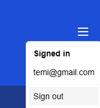

# Projektbericht: Wettbewerb Finder

1. Einführung

2. Warum?Warum jetzt?

3. Warum so?

4. Wie wird es in der Zukunft zur Welt beitragen?

5. Warum unser Team dafür qualifiziert ist

6. Wie begeistern wir andere?
   
   1. Aufbau und Design des Videos
   
   2. Produktion
   
   3. Reichweite und Verbreitung

7. Unser Prototyp
   
   1. Technologien und Bibliotheken
      
      1. Frontend – Next.js & React
      
      2. Styling – Tailwind CSS
      
      3. Backend – PostgreSQL & Drizzle ORM
   
   2. Datenbank
      
      1. Zentrale Entität:  ` user `
      
      2. Rollen: `student` und `teacher`
      
      3. Wettbewerbe: `competition`
      
      4. Interessen: `interests`
      
      5. Bevorzugte Zweige: `prefBranch`
      
      6. Zweige: `branch`
      
      7. Beziehungen im Schema
   
   3. Front- End
      
      1. Übergreifende Funktionen
      
      2. Home Page
      
      3. Kalender

8. Fazit und Ausblick

## Einführung

In der heutigen digitalen Welt spielen Wettbewerbe eine entscheidende Rolle bei der Förderung von Kreativität, Engagement und Wissenserweiterung von Schüler*innen. Allerdings fehlt es vielen Schulen an einer zentralen Plattform, um aktuelle Wettbewerbe übersichtlich darzustellen und die Teilnahme zu erleichtern.

Das Ziel dieses Projekts ist die Entwicklung einer modernen und benutzerfreundlichen Website, die aktuelle Wettbewerbe auflistet und es Schulen ermöglicht, diese einfach zu verwalten und zu bearbeiten. Durch ein ansprechendes Design und eine intuitive Benutzeroberfläche soll die Website nicht nur informativ, sondern auch motivierend wirken, um die Teilnahmequote der Schüler*Innen zu erhöhen.

Ein weiterer wichtiger Aspekt ist die einfache Integration der Plattform in bestehende Schulwebsites. So können Schulen ohne großen technischen Aufwand Wettbewerbe direkt in ihre Online-Präsenz einbinden und aktuell halten.

Mit diesem Projekt wird ein wertvoller Beitrag zur Förderung von schulischen und außerschulischen Aktivitäten geleistet, indem eine zentrale, gut zugängliche Lösung für Wettbewerbsinformationen geschaffen wird.

## Warum? Warum jetzt?

Die Teilnahme an Wettbewerben stellt eine wertvolle Erfahrung für alle Beteiligten dar. Die vielseitigen Herausforderungen und Lernmöglichkeiten, die sich aus der Teilnahme ergeben, helfen jungen Menschen dabei, ihre Interessen zu entdecken, ihre Stärken weiterzuentwickeln und eine Gemeinschaft mit ihren Mitschüler*innen zu bilden. Darüber hinaus stärkt der Wettbewerbsgedanke nicht nur den Teamgeist, sondern vermittelt auch von klein auf den fairen Umgang mit Konkurrenz und anderen Teams.

Durch Wettbewerbe werden Innovationen und kreative Ideen gefördert, die nicht nur den teilnehmenden Schüler*innen, sondern auch der Gesellschaft insgesamt zugutekommen können. Viele bedeutende Erfindungen und Entwicklungen sind aus Wettbewerben hervorgegangen. Daher ist es essenziell, junge Menschen zu ermutigen, sich aktiv zu beteiligen und ihre Fähigkeiten weiterzuentwickeln.

Gerade jetzt ist die Implementierung einer solchen Plattform besonders wichtig, da der digitale Wandel neue Möglichkeiten zur Vernetzung und Informationsbereitstellung bietet. Schulen stehen vor der Herausforderung, Schüler*innen gezielt zu fördern und ihnen mehr Gelegenheiten zur Teilnahme an Wettbewerben zu bieten. Eine zentrale, digitale Lösung kann hier eine effektive Unterstützung sein. 

## Warum so?

Eine einfache, leicht anpassbare Website ermöglicht es Schulen, Wettbewerbe gezielt zu präsentieren und solche auszuwählen, die inhaltlich und didaktisch mit den Bildungszielen der Schule übereinstimmen. Dadurch wird sichergestellt, dass Schüler*innen gezielt gefördert werden und sich an Wettbewerben beteiligen können, die ihrem Interesse und ihrer Ausbildung entsprechen – ohne dabei von externen Organisationen oder Dritten abhängig zu sein.

Für die Umsetzung ist lediglich die Beteiligung von Lehrkräften erforderlich, die als Kontaktpersonen für die jeweiligen Wettbewerbe fungieren. Sie können Wettbewerbe auf der Plattform eintragen, aktualisieren und Schüler*innen beraten. Dies stellt sicher, dass Interessierte unkompliziert an Informationen gelangen und sich bei Interesse direkt anmelden können.

Unser Projekt setzt auf Eigeninitiative, Entscheidungsfähigkeit und Kooperation. Dadurch wird nicht nur der organisatorische Aufwand für Schulen minimiert, sondern auch junge Menschen auf zukünftige Projektarbeiten vorbereitet. Sie lernen, selbstständig nach Möglichkeiten zu suchen, sich zu organisieren und im Team zu arbeiten – wichtige Fähigkeiten, die sie in Studium und Beruf weiterbringen werden.

## Wie wird es in der Zukunft zur Welt beitragen?

Unser Projekt wurde mit einem ganzheitlichen und zukunftsorientierten Ansatz entwickelt, um nachhaltig zur Gesellschaft beizutragen. Durch die Förderung von Wettbewerben werden nicht nur Bildung und Innovationskraft gestärkt, sondern auch langfristige soziale und ökologische Vorteile geschaffen. Wettbewerbe können sich beispielsweise auf nachhaltige Entwicklung, technologische Fortschritte und soziale Verantwortung fokussieren und somit junge Menschen dazu inspirieren, Lösungen für aktuelle globale Herausforderungen zu finden.

Darüber hinaus wird die Plattform kontinuierlich weiterentwickelt, um mit den sich wandelnden gesellschaftlichen und ökologischen Anforderungen Schritt zu halten. Die digitale Bereitstellung von Informationen reduziert den Bedarf an gedrucktem Material und trägt damit zur Schonung natürlicher Ressourcen bei. Gleichzeitig fördert das Projekt die Vernetzung von Schüler*innen und Schulen, um Synergien für nachhaltige Projekte zu schaffen und langfristig eine verantwortungsbewusste Generation zu formen.

Indem wir Innovation, Bildung und nachhaltige Entwicklung miteinander verknüpfen, leisten wir mit unserer Plattform einen wertvollen Beitrag zur Welt von morgen.

## Warum unser Team dafür qualifiziert ist

Unser Team besteht aus engagierten Schüler*innen einer HTL, die sich intensiv mit den Bereichen Programmierung und Medientechnik auseinandersetzen. Durch unsere Ausbildung haben wir fundierte Kenntnisse in der Softwareentwicklung, was es uns ermöglicht, eine effiziente und benutzerfreundliche Plattform zu gestalten. Zudem bringen wir Erfahrung in der Videoproduktion mit, die es uns erlaubt, ansprechende und informative Inhalte zu erstellen, um die Plattform optimal zu präsentieren und deren Nutzung zu erleichtern.

Unsere technische Expertise in der Webentwicklung, kombiniert mit unserer kreativen Fähigkeit zur Gestaltung multimedialer Inhalte, macht uns besonders qualifiziert für dieses Projekt. Wir sind in der Lage, innovative Lösungen zu entwickeln und gleichzeitig sicherzustellen, dass unsere Plattform eine breite Zielgruppe anspricht und nachhaltig genutzt werden kann.

## **Wie begeistern wir andere?**

Um mehr Interesse für die Teilnahme an diesen Wettbewerben zu wecken, haben wir speziell für die IT-Abteilung unserer Schule Videos produziert, die den Inhalt der Wettbewerbe ansprechend und verständlich präsentieren. Unser Ziel ist es, mit diesen Videos so viele Schüler*innen und Lehrkräfte wie möglich zu motivieren. Dabei setzen wir auf eine klare Struktur, damit die Informationen nicht nur hängen bleiben, sondern auch Lust auf mehr machen.

### **1. Aufbau und Design des Videos**

Damit das Video nicht langweilig wird, achten wir auf:

- **Dynamische Schnitte und Effekte:** Diese sorgen für Abwechslung und halten das Interesse der Zuschauer aufrecht.

- **Einfache und verständliche Erklärungen:** Wir vermeiden komplizierte Formulierungen und setzen auf eine klare, direkte Sprache.

### **2. Produktion**

- **Planung:** Unser Team hat gemeinsam ein Skript geschrieben und eine detaillierte Szenenliste erstellt, um den Dreh effizient zu gestalten.

- **Dreh:** An zwei verschiedenen Tagen haben wir mit professionellem Kamera- und Audio-Equipment alle geplanten Szenen gemäß unserem Zeitplan aufgenommen.

- **Videoschnitt:** Die besten Szenen wurden ausgewählt, geschnitten und mit passender Musik untermalt, um eine ansprechende Atmosphäre zu schaffen.

- **Probleme & Lösungen:** Fehlende Audio-Clips wurden im Nachhinein nachvertont, um eine gleichbleibend hohe Qualität sicherzustellen.

### **3. Reichweite und Verbreitung**

Damit das Video eine möglichst große Zielgruppe erreicht, setzen wir auf verschiedene Kanäle:

- **Website für Wettbewerbe:** Das Video wird direkt auf der Startseite eingebunden, um maximale Sichtbarkeit zu gewährleisten.

- **Schulwebseiten:** Lehrkräfte haben die Möglichkeit, das Video unkompliziert mit ihren Schüler*innen zu teilen.

## Unser Prototyp

Wir haben viel Zeit investiert um eine funktionierende Webseite zu programmieren. Diese soll alle vorher erwähnten Funktionen enthalten. Da es im Moment noch in der Produktion findet, müssen noch manche Funktionen implementiert werden. Die nachfolgenden Informationen dienen zur Visualisierung der kommenden Funktionen. 

## **Technologien und Bibliotheken**

Um die Inhalte auf unserer Webseite dynamisch darstellen zu können, setzen wir auf bewährte Technologien und moderne Frameworks. Diese ermöglichen nicht nur eine hohe Performance, sondern auch eine flexible und effiziente Entwicklung.

### **Frontend – Next.js & React**

Für das Frontend unserer Webseite haben wir uns für **Next.js** in Kombination mit **React** entschieden.

#### **Warum Next.js?**

Next.js ist ein leistungsstarkes Framework für React, das sich besonders für serverseitig gerenderte Anwendungen und statische Webseiten eignet. Es bietet zahlreiche Vorteile:

- **Server-Side Rendering (SSR):** Inhalte können bereits auf dem Server gerendert werden, wodurch die Ladezeiten deutlich verkürzt und die Benutzererfahrung verbessert wird.
- **Static Site Generation (SSG):** Wichtige Seiten können vorab generiert und gecacht werden, was die Performance erheblich steigert.
- **SEO-Optimierung:** Durch die serverseitige Darstellung der Inhalte verbessert sich die Sichtbarkeit in Suchmaschinen.

#### **Warum React?**

React ist eine der populärsten JavaScript-Bibliotheken für die Entwicklung interaktiver Benutzeroberflächen. Vorteile sind:

- **Komponentenbasierte Architektur:** Erlaubt die Wiederverwendung von UI-Elementen, was die Entwicklung effizienter macht.
- **Große Community & viele Erweiterungen:** React ist weit verbreitet, gut dokumentiert und bietet zahlreiche Drittanbieter-Bibliotheken.

### **Styling – Tailwind CSS**

Um das Design unserer Webseite effizient und flexibel zu gestalten, verwenden wir **Tailwind CSS**.

#### **Warum Tailwind CSS?**

- **Utility-First-Ansatz:** Ermöglicht schnelle und konsistente Gestaltung direkt im HTML-Code.
- **Hohe Anpassbarkeit:** Farben, Abstände und Stile können einfach konfiguriert und erweitert werden.

### **Backend – PostgreSQL & Drizzle ORM**

Für die Speicherung und Verwaltung der Daten setzen wir auf eine **PostgreSQL-Datenbank** in Kombination mit **Drizzle ORM**.

#### **Warum PostgreSQL?**

PostgreSQL ist eine leistungsfähige, relationale Open-Source-Datenbank mit zahlreichen Features:

- **ACID-Konformität:** Sorgt für eine hohe Datensicherheit und Integrität.
- **Erweiterbarkeit:** Unterstützt JSON-Daten, Full-Text-Suche und viele weitere moderne Funktionen.

#### **Warum Drizzle ORM?**

Drizzle ist eine moderne ORM-Lösung (Object-Relational Mapping) für TypeScript und JavaScript. Es bietet:

- **Minimale Abhängigkeiten:** Im Vergleich zu schwergewichtigen ORM-Lösungen wie Prisma ist Drizzle schlank und performant.
- **Einfache Migrationsverwaltung:** Datenbankänderungen können einfach versioniert und angepasst werden.

## Datenbank

Um unser Datenbank schema übergreiflich darzustellen haben wie dieses Modell generieren lassen:

Das gezeigte Datenbankschema stellt eine relational strukturierte Datenbank dar, die verschiedene Entitäten und ihre Beziehungen modelliert. Hier folgt eine detaillierte Analyse der einzelnen Tabellen und ihrer Verknüpfungen:

### 1. **Zentrale Entität: `user`**

- Die Tabelle `user` speichert grundlegende Informationen über Nutzer, einschließlich `user_id` (Primärschlüssel), `email` und `password`.
- Sie dient als zentrale Referenz für andere Tabellen, um Benutzer eindeutig zu identifizieren.

### 2. **Rollen: `student` und `teacher`**

- `student`: Diese Tabelle enthält `user_id` als Fremdschlüssel, sowie `branch` und `class`, um Studierende bestimmten Zweigen und Klassen zuzuordnen.
- `teacher`: Enthält `user_id` und `shortName`, um Lehrkräfte mit einer Kurzbezeichnung zu speichern.

### 3. **Wettbewerbe: `competition`**

- Diese Tabelle speichert Informationen zu Wettbewerben, einschließlich `comp_id` (Primärschlüssel), `name`, `description`, `date`, `lowestGrade` und `link`.
- Der `user_id`-Fremdschlüssel stellt die Verbindung zu dem Benutzer her, der den Wettbewerb organisiert oder einreicht.

### 4. **Interessen: `interests`**

- Diese Tabelle stellt eine Beziehung zwischen Benutzern (`user_id`) und Wettbewerben (`comp_id`) her, um Interessen der Nutzer an bestimmten Wettbewerben zu speichern.
- Die Spalte `date` gibt das Datum der Interessensbekundung an.

### 5. **Bevorzugte Zweige: `prefBranch`**

- Diese Tabelle verknüpft `competition` mit `branch`, um bevorzugte Zweige für bestimmte Wettbewerbe zu speichern.

### 6. **Zweige: `branch`**

- Diese Tabelle definiert verschiedene Zweige oder Fachrichtungen in einer Schule anhand von `branch_id` und `name`.

### **Beziehungen im Schema:**

- `user` ist über `user_id` mit `student`, `teacher`, `competition` und `interests` verbunden.
- `competition` steht über `comp_id` mit `interests` und `prefBranch` in Beziehung.
- `student` ist mit `branch` über `branch_id` verknüpft.
- `prefBranch` verbindet `branch` mit `competition`.

Das Schema bietet eine strukturierte und normalisierte Datenbankarchitektur zur Verwaltung von Benutzern (Lehrer und Studenten), Wettbewerben sowie Interessens- und Präferenzverbindungen. Diese Struktur ermöglicht eine effiziente Speicherung, Abfrage und Verwaltung von Daten für ein wettbewerbsbezogenes System.

## Front-End

Die Informationen die in den folgenden Bildern zu sehen sind, sind nur Platzhalter um alle wichtigen Funktionen hier darzustellen.

### Übergreifende Funktionen

Auf jeder Seite sind der Titel mit der Navigationsbar und der Fuß der Webseite mit rechtlichen Informationen zu sehen. Die in der Navigations Bar zu sehende Test Funktion ist wie der Name sagt zum testen verwendet worden und wird im fertigen Produkt nicht enthalten sein.

Mit dem Menü Knopf oben rechts kann man sich einloggen:

Der Log-in knopf führt zu einem Formular wo man sich anmelden kann.

Oder ausloggen:

Und für Lehrer werden extra Funktionen sichtbar sein, wie das hinzufügen oder editieren von Wettbewerben.

### Home Page

Auf dieser Seite werden die Wettbewerbe mit Karten aufgelistet. Wichtige Informationen können hier schnell abgelesen werden. Jeder dieser Karten wird einen Link beinhalten der zur einer neuen Seite führt wo alle Informationen zu sehen sein werden. Auf dieser Seite wird auch das video zum jeweiligen Wettbewerb zu sehen sein.

### Kalender

Hier werden in einem Kalender Format alle Fristen für Wettbewerbe sichtbar sein.

## **Fazit und Ausblick**

Mit der Entwicklung dieser Plattform haben wir eine Lösung geschaffen, die Schüler*innen und Schulen eine einfache Möglichkeit bietet, sich über aktuelle Wettbewerbe zu informieren und daran teilzunehmen. Durch eine intuitive Benutzeroberfläche, moderne Technologien und eine nahtlose Integration in bestehende Schulwebsites erleichtert unser Projekt den Zugang zu Wettbewerben und fördert gleichzeitig die aktive Teilnahme.

Neben der technischen Umsetzung haben wir auch einen starken Fokus auf die Motivation der Schüler*innen gelegt. Mit ansprechenden Videos und einer gezielten Verbreitung unserer Inhalte möchten wir möglichst viele junge Menschen dazu inspirieren, sich neuen Herausforderungen zu stellen und ihre Talente weiterzuentwickeln.

Dieses Projekt hat uns nicht nur technisches Wissen und praktische Erfahrung vermittelt, sondern auch unsere Teamarbeit, Organisation und Problemlösungsfähigkeiten gestärkt. Die Entwicklung einer funktionalen und nachhaltigen Lösung erfordert nicht nur Fachwissen, sondern auch Kreativität und eine vorausschauende Denkweise – Fähigkeiten, die wir durch dieses Projekt vertieft haben.

Für die Zukunft sehen wir großes Potenzial für die Weiterentwicklung unserer Plattform. Geplante Erweiterungen wie eine verbesserte Such- und Filterfunktion, eine mobile App sowie die Möglichkeit für Schulen, eigene Wettbewerbe direkt über die Plattform zu organisieren, werden den Nutzen unserer Lösung weiter steigern.

Wir sind überzeugt, dass unser Projekt einen wertvollen Beitrag zur Förderung von Bildung, Kreativität und Innovation leistet – heute und in der Zukunft. 
